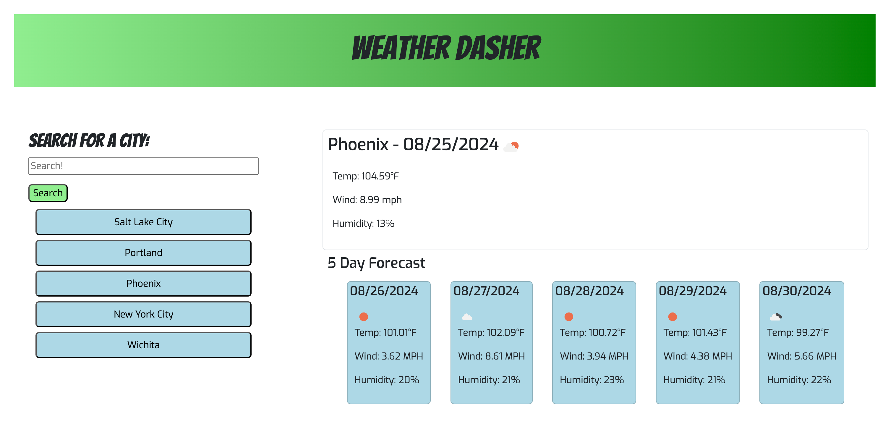

# Weather-Dasher

## Description
This is a weather dashboard application that will run in the browser and feature dynamically generated HTML and CSS. It also uses a third party API, called OpenWeather, for all weather data. This application allows you to search by city and retrieves the weather data based on latitude and longitude, thanks to a JavaScript function that retrieves that information. The user doesn't have to know the latitude and longitude, only the city name, and the function does the rest.

All of the forecast and current weather data is dynamically generated so the user can truly customize their very own weather dashboard.

## Table of Contents
* [Installation](#installation)
* [Usage](#usage)
* [License](#license)
* [Contributing](#contributing)
* [Credits](#credits)
* [Tests](#tests)
* [Questions](#questions)

## Installation
Installation instructions for application:
N/A

## Usage
[Click here for deployed application](https://elenapapanikolas.github.io/Weather-Dasher/)

Navigate to the link above for the deployed application. 
The user is presented with the Weather Dashboard application. There is a search bar and search button. Simply enter the city name for which you'd like to know the weather and click the search button. The current weather will be rendered, along with a five day forecast rendered underneath. The data shows the city name, date, temperature, wind, humidity, and a weather icon, visually depicting the conditions. Every city you search for is saved with local storage and rendered to a list below the search bar. Clicking on these saved searches will automatically search the weather conditions for that city with just a click.

## License 
This project is operating under the MIT license. For more detailed information about the license, please click [here](https://opensource.org/licenses/MIT).

## Contributing 
Please contact me for any contributions.

## Credits
N/A

## Tests
To run tests for the application:
N/A

## Questions 
Contact me with any questions regarding this project:

GitHub: [ElenaPapanikolas](https://github.com/ElenaPapanikolas)

Email: epapanikolas@hotmail.com
